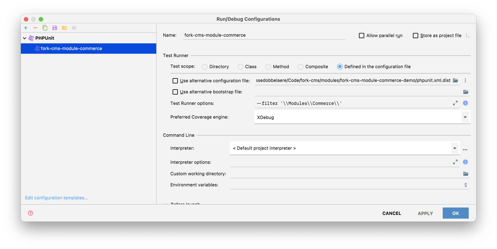

# Local development

## Symlinking the module

When developing locally, I usually create a symlink between this git repository and an actual Fork CMS installation, e.g.:

```bash
ln -sf ~/Code/fork-cms/modules/fork-cms-module-commerce/src/Backend/Modules/Commerce ~/Code/fork-cms/modules/fork-cms-module-commerce-demo/src/Backend/Modules/Commerce
ln -sf ~/Code/fork-cms/modules/fork-cms-module-commerce/src/Backend/Modules/CommerceCashOnDelivery ~/Code/fork-cms/modules/fork-cms-module-commerce-demo/src/Backend/Modules/CommerceCashOnDelivery
ln -sf ~/Code/fork-cms/modules/fork-cms-module-commerce/src/Backend/Modules/CommercePickup ~/Code/fork-cms/modules/fork-cms-module-commerce-demo/src/Backend/Modules/CommercePickup
ln -sf ~/Code/fork-cms/modules/fork-cms-module-commerce/src/Frontend/Modules/Commerce ~/Code/fork-cms/modules/fork-cms-module-commerce-demo/src/Frontend/Modules/Commerce
ln -sf ~/Code/fork-cms/modules/fork-cms-module-commerce/src/Frontend/Themes/CommerceDemo ~/Code/fork-cms/modules/fork-cms-module-commerce-demo/src/Frontend/Themes/CommerceDemo
```

This is optional ofcourse, but it's far easier than having to copy the module code from your Fork CMS installation.

## Setup Fork CMS

See README.md on how to install the module in your Fork CMS setup.

## Fixtures

We use [DoctrineFixturesBundle](https://symfony.com/doc/current/bundles/DoctrineFixturesBundle/index.html) to reset and reload fixtures data in our local DB. Execute this command with the `--append` flag to prevent erasing the whole database:

```bash
bin/console doctrine:fixtures:load --append --group=module-commerce
```

## Unit tests with PHPUnit

We use PHPUnit and create fixture objects using the awesome [zenstruck/foundry](https://github.com/zenstruck/foundry) library. This allows for an readable and expressive, on-demand fixture system to quickly create a certain situation, e.g. `ProductTest.php`. Check out the [Symfonycasts series on Foundry](https://symfonycasts.com/screencast/symfony-doctrine/foundry).

```php
public function it_can_get_a_discounted_price_with_vat(): void
{
    $product = ProductFactory::new()
        ->withPrice('299,99')
        ->withVat(21.00)
        ->withNewSpecial('240,00', (new DateTime())->modify('-1 day'))
        ->create();
    self::assertEquals('36299', $product->getOldPrice(true)->getAmount());
    self::assertEquals('29040', $product->getActivePrice(true)->getAmount());
    self::assertTrue($product->hasActiveSpecialPrice());
}
```

To run the all module(s) tests, simply run `simple-phpunit` using the filter option to run both backend and frontend tests:

```bash
bin/simple-phpunit --filter '\\Modules\\Commerce'
```

or run them from PhpStorm: 

1. Go to 'Add Configuration' > 'New configuration' > 'PHPUnit'
2. Enter a name and select 'Test scope: Defined in the configuration file'
3. Enter a filter in the Test runner options: `--filter '\\Modules\\Commerce'` to run both frontend and backend tests.
4. Run the tests from PhpStorm using the green play button


